# Лабораторна робота 2

Зробив маленьку бібліотеку на TypeScript. Вона додає числа, змінює першу букву рядка на велику, форматує числа і групує об'єкти. Ще є простий Logger з трьома рівнями повідомлень.

Основний код лежить у `src/index.ts`, налаштування середовища у `src/config.ts`, приклади запуску у `src/demo.ts`. `dotenv` і `zod` потрібні під час роботи бібліотеки. Компілятор, збирач і перевірки стоять у `devDependencies`.

Запуск

Працював з Node.js 24.18.0 і npm 11.16.0. Для запуску потрібен Node.js 22.12 або новіший.

```bash
git clone https://github.com/INotSleep/typescript-utils-lab2.git
cd typescript-utils-lab2
npm i
cp .env.example .env
npm run demo
npm run build
```

Збірка створює `dist/index.cjs`, `dist/index.mjs` і файли типів. Для перевірок є `npm run typecheck`, `npm run lint`, `npm run format:check` та `npm test`. Форматування виправляється через `npm run format`.

Приклад для поточної версії

```ts
import { add, capitalize, formatNumber, groupBy, Logger } from './src/index';

console.log(add([2, 3, 4])); // 9
console.log(capitalize('hello')); // Hello
console.log(formatNumber(123.456, { precision: 2 })); // 123.46

const users = [
  { id: 1, name: 'Alice' },
  { id: 2, name: 'Bob' },
  { id: 3, name: 'Alice' },
];
console.log(groupBy(users, 'name')); // Alice: два об'єкти, Bob: один

const logger = new Logger('debug');
logger.info('demo started');
logger.debug('details');
```

У `.env.example` залишив такі значення:

```dotenv
APP_PRECISION=3
LOG_LEVEL=debug
```

`APP_PRECISION` має бути цілим числом від 0 до 10, а `LOG_LEVEL` може бути `silent`, `info` або `debug`. Без `.env` беруться 2 та `info`. Неправильні значення відхиляє zod. Сам `.env` додав у `.gitignore`, разом з `node_modules` і `dist`.

Як мінявся код

Спочатку склонував порожній репозиторій, пройшов `npm init` і вказав версію 0.0.0. Потім налаштував TypeScript, ESLint, Prettier та хуки. На скрінах з помилками ще стоїть попередній номер пакета: версію піднімав уже після виправлень.

[0.1.0](https://github.com/INotSleep/typescript-utils-lab2/tree/v0.1.0). Додав `add` і `capitalize` з `any`. TypeScript пропустив код, але ESLint знайшов `unused`, а Prettier подвійні лапки. Прибрав зайву змінну, виправив форматування і зробив перший minor.

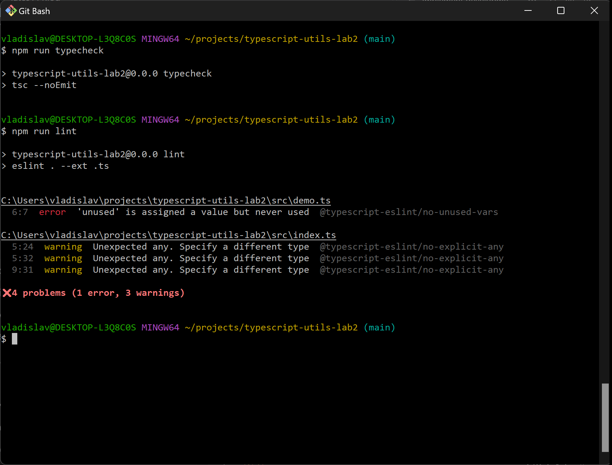

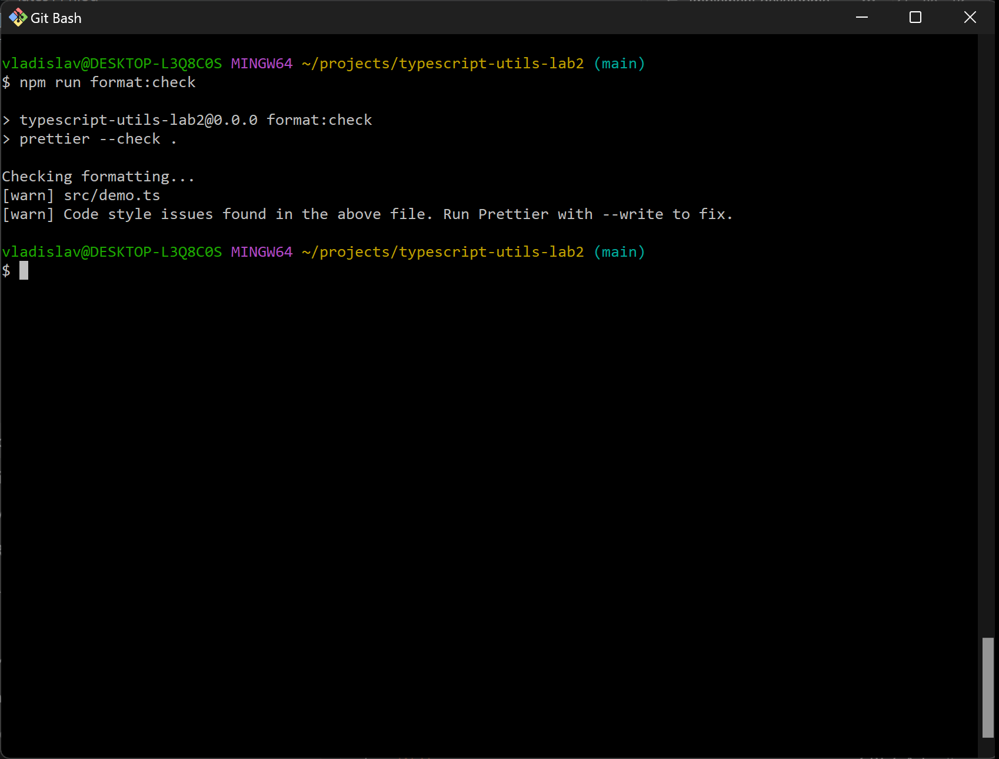

[0.2.0](https://github.com/INotSleep/typescript-utils-lab2/tree/v0.2.0). Замінив `any` на `number` і `string`. Виклики `add('2', 3)` та `capitalize(123)` перестали проходити перевірку, тому виправив аргументи. Це наступний minor у навчальній версії 0.x.

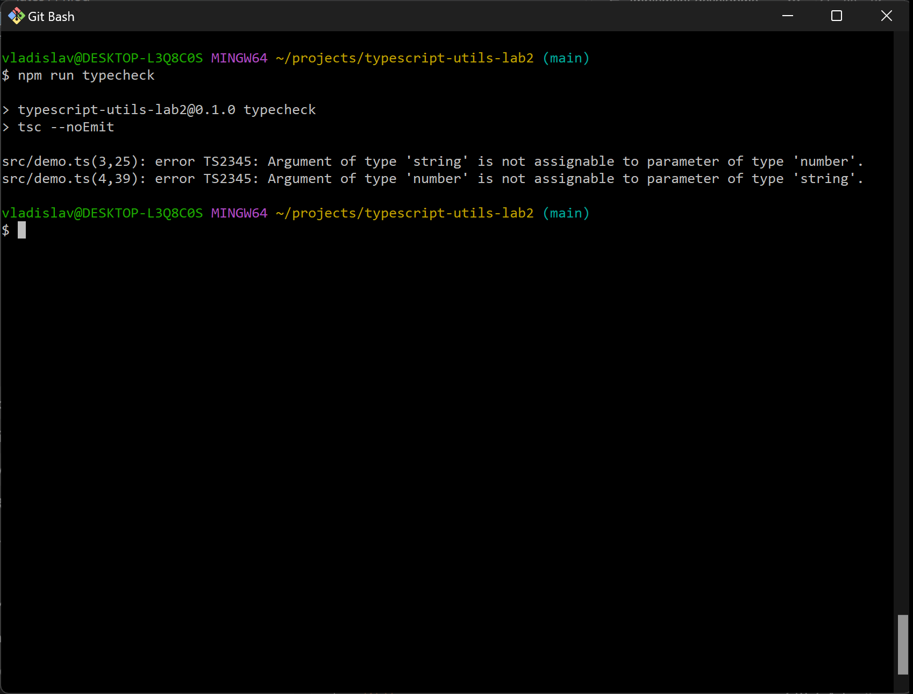

[0.3.0](https://github.com/INotSleep/typescript-utils-lab2/tree/v0.3.0). Додав `formatNumber` і тип `NumberFormatOptions`, тому підняв minor. Замість рядка `'abc'` передав число. Точність можна задати параметром, а локаль через `locale`.

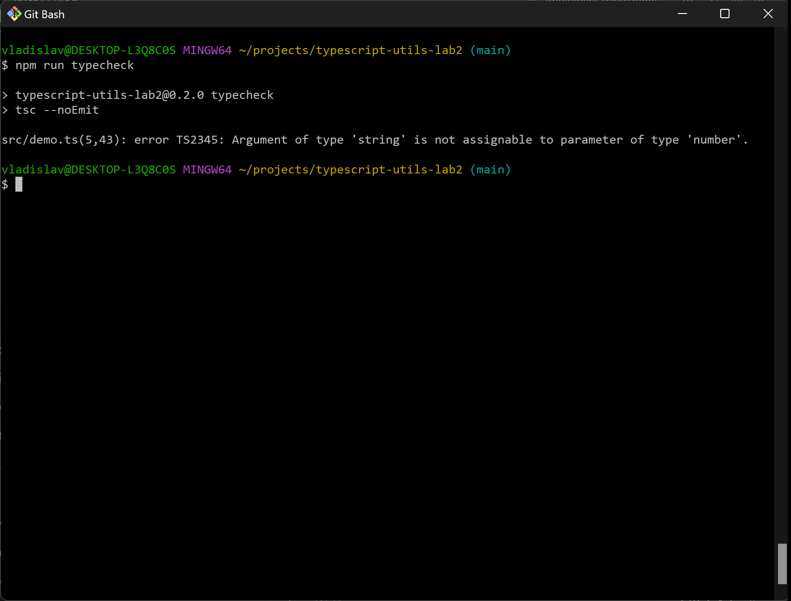

[0.4.0](https://github.com/INotSleep/typescript-utils-lab2/tree/v0.4.0). Додав інтерфейс `User` і `groupBy<T>`. Ключа `age` у користувача немає, замінив його на `name`. Нова функція, тому знову minor.

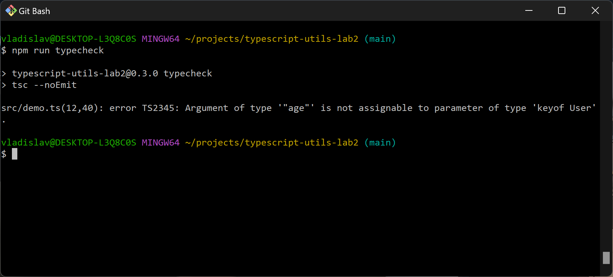

[0.5.0](https://github.com/INotSleep/typescript-utils-lab2/tree/v0.5.0). Додав `Logger`, `.env` і перевірку конфігурації через zod. Замість рівня `verbose` використав `config.LOG_LEVEL`. Це нові можливості без зміни попередніх викликів, тому minor.

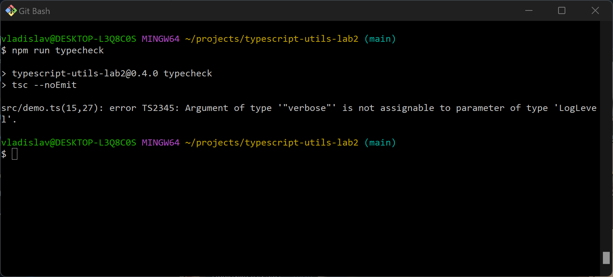

[1.0.0](https://github.com/INotSleep/typescript-utils-lab2/tree/v1.0.0). Зібрав публічні експорти в `src/index.ts`, налаштував CJS, ESM і типи пакета. Правило для `any` змінив з попередження на помилку. Major тут фіксує перший стабільний API.

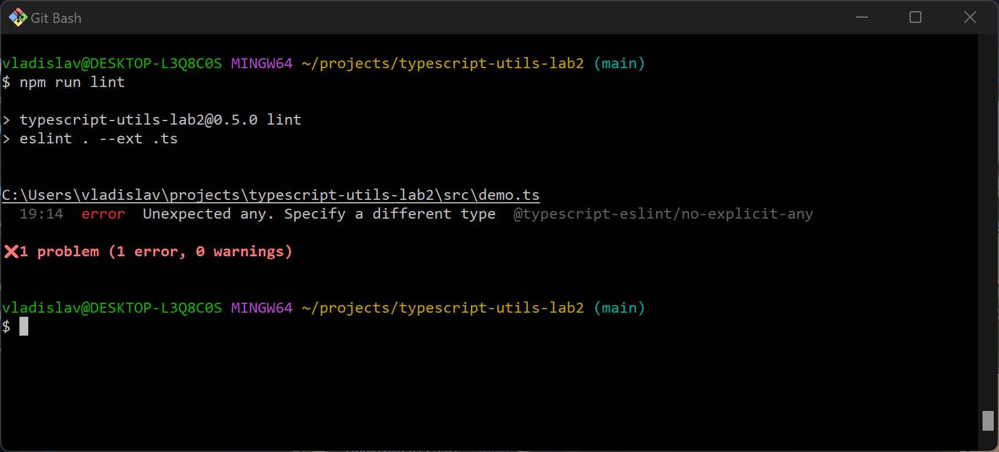

[2.0.0](https://github.com/INotSleep/typescript-utils-lab2/tree/v2.0.0). `add` тепер приймає масив. Старий виклик `add(2, 3)` не працює, у demo замінив його на `add([2, 3, 4])`. Через цю несумісну зміну підняв major.

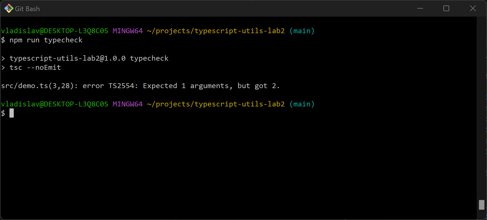

Перевірка результату

Husky перед комітом запускає lint, format:check і typecheck. Окремо перевірив, що коміт із зайвою змінною блокується. Commitlint також відхилив повідомлення `bad message`. Обидві невдалі спроби не потрапили в історію.

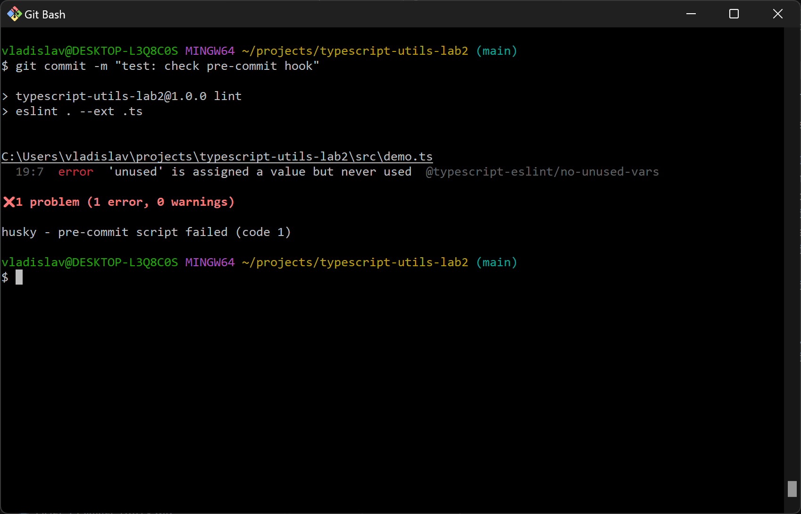

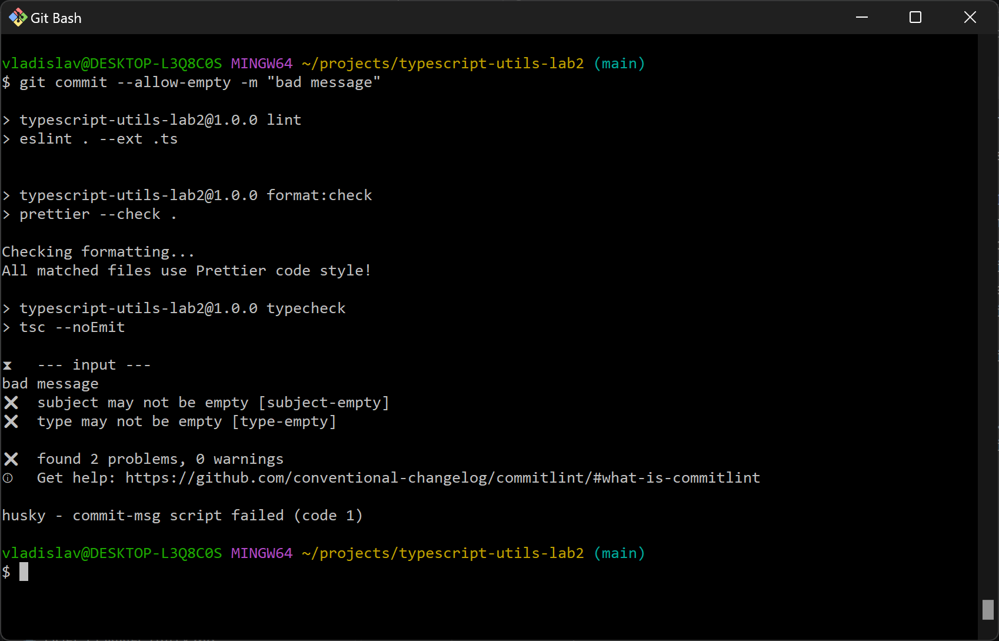

Після виправлень перевірки проходять. Тести перевіряють функції, рівні Logger, неправильні значення `.env` і завантаження CJS та ESM. У demo сума масиву дорівнює 9, а точність з `.env` дає `123.456`.

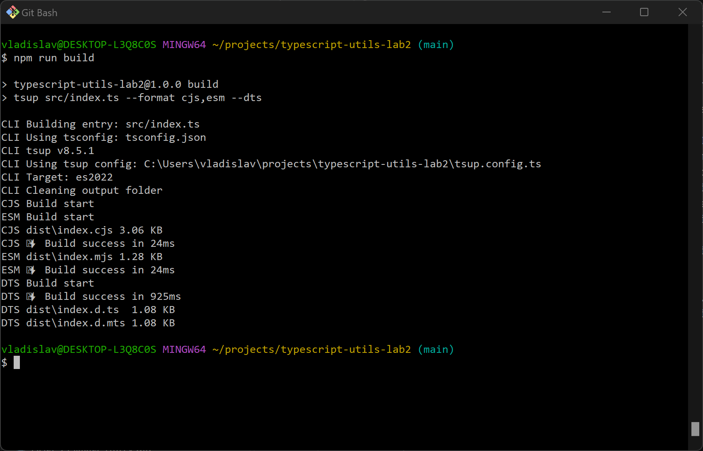

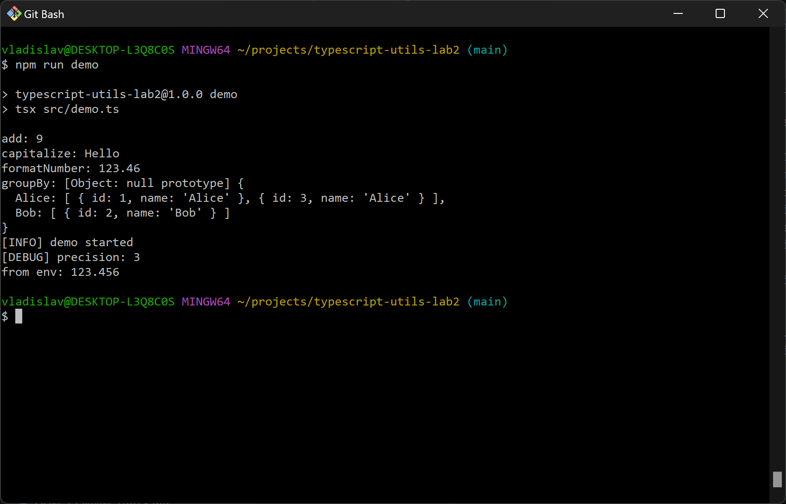

Версії піднімав через `npm version minor` і `npm version major`, теги відправляв командою `git push --follow-tags`. У `.npmrc` задав повідомлення `chore(release): %s`, щоб коміти версій проходили Commitlint.
